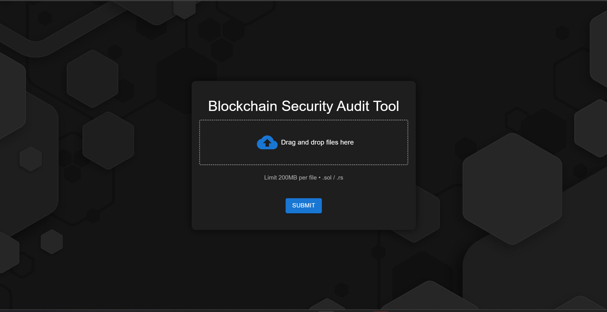

# Blockchain Security Audit Tool

This is a React application that provides a tool for uploading Solidity contract files for security auditing. The application features a modern, full-screen design with a background image and a file upload form styled with Material-UI.

## Features

- Full-screen design with a background image
- Modern, user-friendly interface
- File upload form with drag and drop functionality
- Styled using Material-UI for a consistent look and feel
  
Master Branch -

Without_Dotted_Line Branch - 

